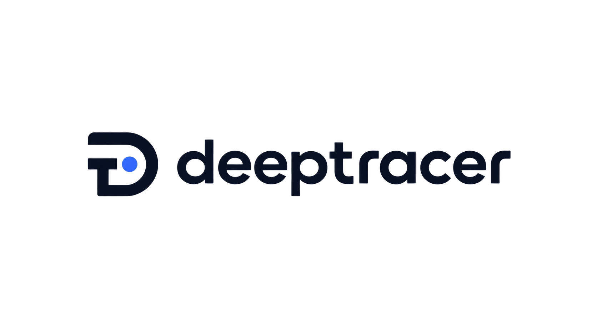

**AI agent가 왜 실패했는지를 인간이 한눈에 이해할 수 있게 보여주는 의미 단위 디버깅 도구**

<!-- TODO: 데모 추가 (스크린샷 / GIF / 동영상 링크) -->
<!-- 예시:

또는 동영상:

-->

> ⚠️ 현재 설계 단계입니다. 아직 사용 가능한 코드는 없습니다.

---

## 무엇을 해결하나요?

AI agent(Claude Code, Codex, Cursor 등)는 하나의 작업을 하기 위해 수십~수백 번의 API call을 만듭니다. 기존 로깅은 이 call들을 시간순으로 나열할 뿐이라, 정작 중요한 질문에 답하지 못합니다:

- 이 실패의 **근본 원인**은 무엇인가?
- 7단계에서 터진 에러가 사실은 **2단계의 잘못된 판단** 때문은 아닐까?
- 흩어진 API call들이 **의미상 하나의 작업**으로 묶이면 어떻게 보일까?

DeepTracer는 agent가 남긴 로그를 읽어, 개별 call이 아니라 **의미 단위(semantic span)**로 묶고, 그 사이의 **인과관계**를 추적해, 실패의 근본 원인을 찾도록 돕습니다.

## 핵심 아이디어

| 구분 | 내용 |
|------|------|
| **의미 우선** | API call 하나가 아니라 "의도" 단위로 본다 |
| **관찰 → 판단 → 행동** | agent의 동작을 Observe → Judge → Act 세 종류의 노드로 모델링 |
| **로그보다 그래프** | 순서 나열이 아니라 "무엇이 무엇을 유발했나"를 인과 그래프로 표현 |
| **비침습적** | agent를 수정하지 않고, agent가 남긴 로그를 밖에서 읽는다 |
| **확장 가능** | Claude Code로 시작하되, 다른 agent를 쉽게 붙일 수 있는 구조 |

## 어떻게 보여주나요?

실패 지점에서 근본 원인까지 이어지는 경로를 **인과 그래프**로 시각화하는 것을 목표로 합니다. (웹 대시보드 기반)

## 지원 예정 Agent

| Agent | 상태 |
|-------|------|
| Claude Code | 🔨 첫 목표 (설계 중) |
| Codex CLI | 📋 이후 확장 |
| Cursor CLI | 📋 이후 확장 |
| Kiro CLI | 📋 이후 확장 |

## 개발 현황

- [x] 문제 정의 및 방향 설정
- [x] 타겟 agent 로그 구조 조사 (Claude Code)
- [ ] 설계 확정
- [ ] MVP 구현 (Claude Code 로그 → 인과 그래프)

## 라이선스

[Apache License 2.0](LICENSE) 예정
